```{r setup, include=FALSE}
required_packages <- c("BiocManager", "knitr", "kableExtra", "SummarizedExperiment", 
                       "readxl", "ggplot2", "ggraph", "plotly", "patchwork", "rvest")

if (!requireNamespace("BiocManager", quietly = TRUE)) {
  install.packages("BiocManager")
}

for (package in required_packages) {
  if (!requireNamespace(package, quietly = TRUE)) {
    if (package == "SummarizedExperiment") {
      BiocManager::install(package)
    } else {
      install.packages(package)
    }
  }
}

lapply(required_packages, library, character.only = TRUE)
```


```{r actualizacion R, include=FALSE}
# knitr::purl("PEC1.Rmd", output = "PEC1.R")
```

## Introducción

La presente PEC está diseñada para consolidar los conocimientos adquiridos sobre las tecnologías ómicas y las herramientas de análisis de datos vistos hasta ahora en el curso. En particular, se centrará en el uso de `Bioconductor` y técnicas de exploración de datos.

El ejercicio propuesto implica seleccionar en primer lugar un conjunto de datos de metabolómica para realizar un análisis simplificado del mismo. Para ello, es fundamental familiarizarse previamente con aspectos clave como las tecnologías ómicas, la gestión de datos en `Bioconductor` y `GitHub`, y los contenedores de datos ómicos como `SummarizedExperiment`.

A través de esta PEC tendremos la oportunidad de planificar y ejecutar un proceso de análisis de datos ómicos que incluye la descarga de datos, la creación de un contenedor adecuado, y la exploración y documentación de los hallazgos. El objetivo final es elaborar un informe detallado que describa cada paso del proceso, así como presentar los resultados en un repositorio de `GitHub`.

## Objetivos 

El objetivo principal de este trabajo es realizar un **análisis exploratorio** de datos provenientes de estudios de metabolómica, utilizando herramientas y metodologías adecuadas para extraer información relevante de los datos seleccionados. Los objetivos específicos incluyen:

1. **Familiarización con las tecnologías ómicas**: comprender los principios y aplicaciones de las diferentes tecnologías utilizadas en metabolómica.

2. **Descarga y manejo de datos**: seleccionar un conjunto de datos de metabolómica de repositorios confiables, asegurando la correcta adquisición de los datos y su formato.

3. **Creación de contenedores de datos**: implementar un contenedor del tipo `SummarizedExperiment` que permita almacenar tanto los datos como los metadatos de manera estructurada, facilitando su posterior análisis.

4. **Exploración de datos**: realizar un análisis exploratorio de los datos mediante técnicas estadísticas y visualizaciones, que ofrezcan una visión general de las características y tendencias en los datos.

5. **Documentación y reporte**: elaborar un informe detallado que describa cada etapa del proceso de análisis, incluyendo la metodología, resultados y reflexiones, así como la reposición del trabajo en un repositorio de `GitHub` para promover la transparencia y reproducibilidad en la investigación.

6. **Desarrollo de habilidades técnicas**: fortalecer las competencias en el uso de herramientas de análisis de datos ómicos, como `Bioconductor` y `GitHub`, para la gestión y análisis de datos en el ámbito de la metabolómica.

## Materiales y Métodos

### Materiales

El conjunto de datos para la realización de esta PEC se ha escogido al azar a partir del archivo `Data_Catalog.xlsx` del repositorio de github: <https://github.com/nutrimetabolomics/metaboData/>

En concreto, se trata del dataset `2023-CIMCBTutorial`, constituido por 149 *features* (metabolitos) para 140 muestras. Este conjunto de datos metabolómicos se basa en el artículo de Chan et al. (2016), publicado en el British Journal of Cancer, en el que se analizaron muestras de orina de 43 pacientes con carcinoma gástrico, 40 con enfermedades gástricas benignas y 40 pacientes sanos mediante espectroscopia de resonancia magnética nuclear ((1)H-NMR) con el objetivo de determinar un perfil metabolómico urinario distintivo en pacientes con carcinoma gástrico con potencial clínico para el diagnóstico temprano.

Los datos descargados directamente del repositorio de `Github` se procesaron para crear una estructura de datos de tipo `SummarizedExperiment`. Se amplió la información de los metadatos de muestras a través de un proceso de *web scraping*.

### Métodos

Diferenciaremos dos grupos de métodos:

- Métodos Bioinformáticos: el principal método bioinformático utilizado fue la creación de un contenedor de datos mediante el paquete `SummarizedExperiment` de `Bioconductor`. Este enfoque permite organizar y almacenar tanto los datos de metabolitos como los metadatos asociados a las muestras de forma estructurada, facilitando el posterior análisis exploratorio. Para este último, nos apoyaremos en los métodos contenidos en el paquete `POMA`, que en su versión más reciente utiliza objetos de tipo `SummarizedExperiment` como argumento en sus funciones. 
Además de R base, otros paquetes de R y aplicaciones utilizados fueron:

  1. `readxl` para la lectura de datos
  2. `knitr` y `kableExtra` para elaboración del informe y de tablas de datos
  3. `plotly`, `ggplot2`, `ggraph` y `pactchwork` dependencias de POMA y para elaboración de gráficos
  4. `rvest` para web scraping
  4. `GitHub` para la creación del repositorio

- Métodos Estadísticos:

  1. Análisis Univariado: se elaboraron histogramas y boxplots para examinar la distribución general de los metabolitos. Se realizaron resúmenes estadísticos generales de los datos. Se comprobó la significación estadística y biológica de las concentraciones de los distintos metabolitos para las categorías GC con respecto a HE con el test de Welch y gráficamente mediante Volcano plot a partir de los datos normalizados, respectivamente.

  2. Análisis Multivariante: se realizó un Análisis de Componentes Principales (PCA) y Agrupamiento Jerárquico para determinar si los categorías clínicas de las muestras se relacionaban con las fuentes de variabilidad del estudio (metabolitos).


## Resultados

### 1. Selección del dataset

En primer lugar necesitamos obtener una copia del archivo `Data_Catalog.xlsx` del repositorio para poder explorarlo y seleccionar el estudio en cuestión. Si queremos hacerlo desde R, necesitaremos el enlace *RAW* para este archivo. Haciendo click sobre el archivo (Figura 3 del Anexo II) podemos copiar el enlace RAW haciendo click derecho del ratón en el botón con este mismo nombre (Figura 4 del Anexo II).

Una vez obtenido el enlace, lo usaremos en el siguiete script para descargar el archivo y leerlo:

```{r carga DataCatalog.xlsx, cache=TRUE}
# URL del archivo Data_Catalog.xlsx en GitHub
github.url <- "https://github.com/nutrimetabolomics/metaboData/raw/refs/heads/main"
file <- "Data_Catalog.xlsx"

# URL completa usando file.path()
datasets_catalog.url <- file.path(github.url, file)

# descargamos el archivo
download.file(datasets_catalog.url, destfile = "Data_Catalog.xlsx", mode = "wb")

# leemos el archivo .xlsx descargado
data <- read_excel("Data_Catalog.xlsx", sheet = 1)

# mostramos el contenido
kable(data[,1:ncol(data)-1]) # sin mostrar la descripción, última columna
```

De esta forma podemos elegir un dataset al azar fijando una semilla aleatoria para reproducibilidad:

```{r seleccion aleatoria del dataset, cache=TRUE}
set.seed (123) # semilla aleatoria
selection<- sample(1:nrow(data),1)

kable(data[selection, 1:ncol(data)-1])

# descripción del estudio
cat(data[selection, ncol(data)]$Description)
```

La propia descripción nos indica que son los datos de espectrometría de Resonancia Magnética Nuclear (NMR) en un estudio de cáncer gástrico utilizado para un tutorial de análisis metabolómico cuyo repositorio en Github se puede acceder mediante este enlace: <https://cimcb.github.io/MetabWorkflowTutorial/Tutorial1.html>.

Puesto que en la Introducción del repositorio de Github se indica que la estructura del mismo está basado en carpetas, es decir, una carpeta `Datasets` con directorios nombrados como en la columna `Dataset` del archivo `Data_Catalog.xlsx`, y dentro de cada uno de ellos, al menos, el conjunto de datos y un archivo `description.md` (Figura 5 del Anexo II).

Podemos obtener más información sobre este conjunto de datos en la descripción del estudio si leemos el archivo `description.md`:

```{r lectura de description.md, warning=FALSE, echo=FALSE}
dataset.folder.url <- file.path(github.url, "Datasets", data[selection,]$Dataset)
file <- "description.md"


description.url <- file.path(dataset.folder.url, file)
description.md <- readLines(description.url)

cat(description.md, sep = "\n")
```

La descripción nos dice que el tutorial se basa en un estudio publicado por Chan et al. (2016) en el British Journal of Cancer. Los datos procesados y anotados fueron depositados en el repositorio Metabolomics Workbench (ID del proyecto PR000699) y son accesibles mediante el DOI: 10.21228/M8B10B. Los espectros (1)H-NMR fueron adquiridas en el Centro Nacional de Resonancia Magnética Nuclear de Alta Frecuencia de Canadá (NANUC), utilizando un espectrómetro Varian Inova de 600 MHz. El análisis espectral y la anotación de metabolitos se realizaron con la suite Chenomx NMR v7.6. Sin embargo, los datos crudos de NMR no están disponibles.

Dentro de esta misma carpeta en el repositorio nos encontramos con el dataset nombrado como `GastricCancer_NMR.xlsx`. Procedemos así a su descarga para el cumplimiento de los objetivos de la PEC:

```{r descarga del archivo dataset del repositorio de Github, cache=TRUE}
file <- "GastricCancer_NMR.xlsx"

# URL completa usando file.path()
dataset.url <- file.path(dataset.folder.url, file)

# descargamos el archivo
download.file(dataset.url, destfile = "GastricCancer_NMR.xlsx", mode = "wb")
```

No hay que olvidar que el propio dataset se encuentra accesible para su descarga en el repositorio de *Metabolomics Workbench* accediendo al Project ID PR000699, en donde obtenemos el siguiente enlace para descargar: <https://www.metabolomicsworkbench.org/studydownload/ST001047.zip>

### 2. Contenedor del tipo SummarizedExperiment

Lo primero que vamos a hacer es determinar la estructura del archivo descargado, de cuántas hojas disponemos y cuáles son sus nombres:

```{r estructura del archivo dataset en Excel, echo=FALSE}
# vemos el número de hojas con la función excel_sheets()
hojas <- excel_sheets(file)

# número de hojas
cat("Número de hojas:", length(hojas), "\n")
# nombres de las hojas
cat("Nombres de las hojas:", hojas)
```
Tenemos entonces `r length(hojas)` hojas en el archivo de Excel, con los nombres `r hojas[1]` y `r hojas[2]`. La estructura de cada una de las hojas es la siguiente:

```{r columnas de las hojas del dataset en Excel, echo=FALSE}
# leemos los datos de la primera hoja
data <- read_excel(file, sheet = 1)
cat("Hoja de Data:", colnames(data), "\n")


# leemos los datos de la segunda hoja
peak <- read_excel(file, sheet = 2)
cat("Hoja de Peak:", colnames(peak))
```

En la primera hoja (`Data`) encontramos las siguientes columnas: 

- Idx: índice
- SampleID: identificador de muestra
- SampleType: indica si la muestra fue un control de calidad agrupado (QC) o una muestra de estudio.
- Class: indica el resultado clínico observado para ese individuo: GC = cáncer gástrico, BN = tumor benigno, HE = control sano
- M1 ... M149: describen las concentraciones de metabolitos

Mientras que para la segunda hoja (`Peak`) están las columnas:

- Idx: índice
- Name: encabezado de la columna correspondiente a este metabolito en la tabla de `Data`
- Label: nombre único para el metabolito (o un identificador `uNNN`)
- Perc_missing: porcentaje de muestras no contienen una medición para este metabolito (datos faltantes)
- QC_RSD: puntuación de calidad que representa la variación en las mediciones de este metabolito en todas las muestras

Con toda esta información podemos generar un objeto de la clase `SummarizedExperiment`. Estos objetos tienen tres componentes principales (slots): 

- Assays: lista de `matrices` que contienen los datos de expresión. Cada matriz debe tener las mismas dimensiones, con filas representando características (genes, proteínas o metabolitos) y columnas representando las muestras.

- rowData: `DataFrame`que almacena los metadatos de las características. Cada fila de rowData corresponde a una fila en las matrices de `assays`. Puede incluir información como el nombre, identificador o calidad para cada metabolito.

- colData: `DataFrame` que almacena los metadatos de las muestras. Cada fila de colData corresponde a una columna en las matrices de `assays`. Puede incluir información sobre el tipo de muestra, tratamiento aplicado o resultado clínico asociado con cada muestra.

Para acceder a la información de cada uno de estos slots basta con llamar a las funciones `assay()`, `rowData()` y `colData()`, respectivamente.

La hoja `Data` posee información tanto para la matriz de los datos de expresión como para `colData`, mientras que la hoja `Peak` contiene información para `rowData`. Para la generación del objeto `SummarizedExperiment` vamos a obviar los índices `Ìdx` y dividir `data`:

```{r preparación del objeto SummarizedExperiment}
# extraemos los metadatos de las muestras (SampleID, SampleType, Class)
sample_metadata <- data[, 2:4]
# extraemos los datos de concentración de metabolitos (columnas M1 a M149) como matriz
concentration <- t(as.matrix(data[, 5:ncol(data)])) # trasponer con t() para dejar
                                                    # las concentraciones de metabolitos
                                                    # en filas

# podríamos renombrar los metabolitos en esta matriz por los Labels de sample_metadata
# pero vamos a dejarlo así teniendo en cuenta que podemos generar una función para 
# obtener el nombre del metabolito posteriormente

colnames(concentration) <- paste0(sample_metadata$SampleID,
                                  "_", sample_metadata$Class) # renombramos las columnas por los 
                                            # nombres de las muestras con su categoría clínica

# creamos el objeto DataFrame de rowData con los metadatos de los metabolitos de la hoja Peak
rowData <- DataFrame(
  Name = peak$Name,
  Label = peak$Label,
  Perc_missing = peak$Perc_missing,
  QC_RSD = peak$QC_RSD
)

# creamos el objeto data,frane de colData con los metadatos de las muestras
colData <- as.data.frame(sample_metadata[1:ncol(sample_metadata)])

# transformamos el tipo de dato de Class a factores para análisis con POMA
colData$Class <- as.factor(colData$Class)

# renombramos la columna SampleID por `Sample name`
colnames(colData)[colnames(colData) == "SampleID"] <- "Sample name"

# cambiamos el orden de las columnas de colData y nos quedamos sólo con
colData <- colData[c("Class", "SampleType", "Sample name")]
```

También podemos extraer información de los metadatos del experimento a partir del Project ID PR000699 en el repositorio *Metabolomics Workbench*: <https://www.metabolomicsworkbench.org/data/DRCCMetadata.php?Mode=Project&ProjectID=PR000699>

```{r metadatos del experimento, echo=FALSE}
# metadatos del experimento
experiment_metadata <- list(
  `Experiment data` = list(
    `Experimenter name` = "Broadhurst David",
    `Laboratory` = "University of Alberta",
    `Contact information` = "d.broadhurst@ecu.edu.au",
    `Title` = "1H-NMR urinary metabolomic profiling for diagnosis of gastric cancer",
    `URL` = "https://pubmed.ncbi.nlm.nih.gov/26645240/",
    `PMIDs` = "26645240",
    `Abstract` = "Background: Metabolomics has shown promise in gastric cancer (GC) detection. This research sought to identify whether GC has a unique urinary metabolomic profile compared with benign gastric disease (BN) and healthy (HE) patients.

Methods: Urine from 43 GC, 40 BN, and 40 matched HE patients was analysed using (1)H nuclear magnetic resonance ((1)H-NMR) spectroscopy, generating 77 reproducible metabolites (QC-RSD <25%). Univariate and multivariate (MVA) statistics were employed. A parsimonious biomarker profile of GC vs HE was investigated using LASSO regularised logistic regression (LASSO-LR). Model performance was assessed using Receiver Operating Characteristic (ROC) curves.

Results: GC displayed a clear discriminatory biomarker profile; the BN profile overlapped with GC and HE. LASSO-LR identified three discriminatory metabolites: 2-hydroxyisobutyrate, 3-indoxylsulfate, and alanine, which produced a discriminatory model with an area under the ROC of 0.95.

Conclusions: GC patients have a distinct urinary metabolite profile. This study shows clinical potential for metabolic profiling for early GC diagnosis."
  )
)
```


Además, podemos ver que el proyecto PR000699 se asocia al estudio ST001047. Realizando un procedimiento de *web scraping* con `rvest` podríamos obtener más información sobre las muestras para el slot `colData`.

```{r web scraping, cache=TRUE, echo=FALSE}
# URL de la página con la tabla datatable de datos de muestra
url <- "https://www.metabolomicsworkbench.org/data/subject_fetch.php?STUDY_ID=ST001047"

# leemos la página
webpage <- read_html(url)

# extraemos y almacenamos la información en un data.frame
df_samples <- webpage %>%
  html_nodes(".datatable") %>%
  html_table() %>%
  .[[1]]  

# fusionamos por la columna Sample name
colData <- merge(colData, df_samples, by = "Sample name", all.x = TRUE, sort=FALSE)

# reordenamos y seleccionamos las columnas que queremos mantener
colData <- colData[c("Class", "SampleType", "Sample name", "mb_sample_id", "Batch")]

# añadimos el batch a los nombres de las columnas de concentration
colnames(concentration) <- paste0(colnames(concentration),
                                  "_B", colData$Batch) # muestra + cat clínica + batch
```


Con todo ello, ya podemos crear nuestro objeto contenedor de la clase `SummarizedExperiment` y guardar el archivo binario `Rda`:

```{r construcción del objeto SummarizedExperiment y guardado del binario Rda}
# creamos el objeto SummarizedExperiment
se <- SummarizedExperiment(
  assays = list(concentration = concentration),
  rowData = rowData,
  colData = colData,
  metadata = experiment_metadata
)

# guardamos el objeto en un archivo binario Rda
save(se, file = "SummarizedExperiment.Rda")

# guardamos los metadatos en archivos CSV
write.csv(colData, "sample_metadata.csv", row.names = FALSE)
write.csv(rowData, "variable_metadata.csv", row.names = FALSE)

# guardamos los datos en CSV
write.csv(as.data.frame(concentration), "data_assay_matrix.csv", row.names = TRUE)

# archivo md con metadatos
# inicializamos el contenido
contenido_md <- c(
  "# Resumen de los Metadatos\n",
  "\n## Metadatos de Muestras\n",
  knitr::kable(as.data.frame(colData), format = "markdown"),
  "\n\n## Metadatos de Features\n",
  knitr::kable(as.data.frame(rowData), format = "markdown")
)

# escribimos el archivo md
writeLines(contenido_md, "resumen_metadatos.md")
```


### 3. Exploración de los datos

El flujo de trabajo que vamos a seguir para la exploración de los datos es el siguiente:

1. Exploración y Preprocesamiento

- Exploración inicial: exploración global con análisis descriptivo de los datos.

- Filtrado: filtraremos metabolitos con `QC_RSD` mayor al 20% y `Perc_missing` superior al 10% para eliminar aquellos con baja calidad de medición.

- Imputación de valores faltantes: si existen valores faltantes, se usará el método `KNN` para imputarlos.

2. Transformación y normalización de los datos

- Transformación logarítmica: aplicamos una transformación logarítmica para reducir la asimetría en la distribución de los datos.

- Normalización de los datos: estandarizamos los datos del assay para su análisis.

- Eliminación de outliers, si los hay.


3. Análisis exploratorio de los datos

- Análisis estadístico global de los datos crudos. Comparación entre categorías GC y HE para los distintos metabolitos mediante test de Welch y gráficamente con Volcano plot con los datos normalizados.

- Análisis de componentes principales (PCA): para evaluar la variación en los datos y visualizar la agrupación de las muestras por categoría clínica.

- Visualización de clusters: utilizaremos una agrupación jerárquica para explorar clusters en los datos que puedan orientarnos sobre un posible *efecto batch* de los datos.


#### Exploración y Preprocesamiento

Antes de nada, vamos a realizar un análisis descriptivo para calcular estadísticos para cada metabolito. Empezaremos extrayendo los datos de concentración de los metabolitos del objeto `SummarizedExperiment`.

```{r datos de concentraciones, echo=FALSE}
concentration.data <- assay(se)
```

Resumimos los estadísticos descriptivos en un DataFrame:

```{r estadísticos resumen datos sin normalizar}
summary.concentration.data <- data.frame(
  Mean = apply(concentration.data, 1, mean, na.rm=TRUE), # media
  Median = apply(concentration.data, 1, median, na.rm=TRUE), # mediana
  SD = apply(concentration.data, 1, sd, na.rm=TRUE), # desviación estándar
  Min = apply(concentration.data, 1, min, na.rm=TRUE), # mínimo
  Max = apply(concentration.data, 1, max, na.rm=TRUE), # máximo
  Q1 = apply(concentration.data, 1, quantile, probs = 0.25, na.rm=TRUE), # 1er quartil
  Q3 = apply(concentration.data, 1, quantile, probs = 0.75, na.rm=TRUE), # 3er cuartil
  IQR = apply(concentration.data, 1, IQR, na.rm=TRUE), # rango intercuartílico
  perc_NA = apply(concentration.data, 1, function(x){ # porcentaje de missing values
    sum(is.na(x)/length(x)*100)
  })
)

head(summary.concentration.data, 10) # sólo mostramos las 10 primeras filas
```

En estos resultados observamos que los distintos metabolitos tienen una gran variabilidad en sus en sus concentraciones, evidenciándose por las diferencias en la desviación estándar (SD) y el rango intercuartílico (IQR). Por ejemplo, M2 tiene una desviación estándar mucho mayor que M1, lo que sugiere una distribución más dispersa. Por otro lado, la diferencia observada entre media y mediana sugiere una distribución sesgada, con asimetría positiva. Estos resultados indican la necesidad de normalización para reducir la influencia de los metabolitos con valores altamente dispersos en el análisis multivariante.

Además, tendremos que realizar un manejo adecuado de los valores faltantes, con imputación de valores, ya que tenemos para algunos metabolitos encontramos elevados porcentajes de missing values (por ejemplo en M9).

Por último, podríamos ver las distribuciones por grupos (QC, GC, BN, HE), para explorar posibles diferencias entre los grupos realizando un `boxplot` para cada uno de los metabolitos. Puesto que son en total 149 metabolitos, guardaremos para visualizar posteriormente los gráficos de cada uno de ellos en un archivo PDF nombrado como `metabolitos_boxplots.pdf`

```{r creación de boxplots de metabolitos, warning=FALSE, echo=FALSE}
crear_boxplot_metabolitos_pdf <- function(se_object, output_file = "metabolitos_boxplots.pdf") {
  # extraer datos de concentración y metadatos
  assay_data <- assay(se_object)
  sample_metadata <- colData(se_object)
  metabolitos <- rownames(assay_data)
  
  # crear un archivo PDF para guardar los gráficos
  pdf(output_file, width = 10, height = 10)
  
  opt <- par(mfrow = c(3, 3))
  # generar boxplots para cada metabolito
  for (metabolito in metabolitos) {
    # extraer los valores del metabolito específico y el grupo de muestra correspondiente
    metabolito_data <- assay_data[metabolito, ]
    grupo_data <- sample_metadata$Class # grupo a partir de Class
    
    # crear boxplot del metabolito por grupo de muestra
    boxplot(metabolito_data ~ grupo_data,
            main = paste("Distribución de", metabolito, "por grupo"),
            xlab = "Grupo",
            ylab = "Concentración",
            col = rainbow(length(unique(grupo_data))),
            notch = TRUE,
            las = 2)  # etiquetas del eje X giradas
  }
  par(opt)
  # cerrar el archivo PDF
  dev.off()
  message("Gráficos boxplot guardados en ", output_file)
}

# llamamos a la función con el objeto SummarizedExperiment
crear_boxplot_metabolitos_pdf(se)
```
Similarmente, podemos crear histogramas de las distribuciones de los metabolitos y guardarlo en otro archivo PDF nombrado como `metabolitos_histograms.pdf`.

```{r creación de histogramas de metabolitos, echo=FALSE, warning=FALSE}
crear_histograma_metabolitos_pdf <- function(data, output_file = "metabolitos_histograms.pdf") {

  pdf(output_file)
  
  opt <- par(mfrow = c(3, 3))
  
  # genera histogramas para cada metabolito
  for (i in 1:ncol(data)) {
    hist(data[, i], main = colnames(data)[i], xlab = "Valores", ylab = "Frecuencia")
  }
  
  par(opt)

  dev.off()
  message("Gráficos de histogramas guardados en ", output_file)
}

crear_histograma_metabolitos_pdf(t(assay(se)))
```

Las distribuciones son sesgadas en su mayoría, tal y como habíamos visto anteriormente. La inspección visual de los resultados nos muestra posibles diferencias entre los grupos clínicos para ciertos metabolitos y valores atípicos. Así pues, encontramos tanto metabolitos más concentrados en el grupo GC en comparación con el grupo HE:

```{r M138 boxplot, warning=FALSE, echo=FALSE}
sample_metadata <- colData(se)
metabolito.name <- rowData[rowData$Name=="M138",]$Label
boxplot(concentration.data["M138", ] ~ sample_metadata$Class, 
        notch = TRUE, 
        col=rainbow(length(unique(sample_metadata$Class))),
        main = paste("Distribución de", metabolito.name, "por grupo"))
```


Como menos concentrados:

```{r M8 boxplot, warning=FALSE, echo=FALSE}
sample_metadata <- colData(se)
metabolito.name <- rowData[rowData$Name=="M8",]$Label
boxplot(concentration.data["M8", ] ~ sample_metadata$Class, 
        notch = TRUE, 
        col=rainbow(length(unique(sample_metadata$Class))),
        main = paste("Distribución de", metabolito.name, "por grupo"))
```

Lo siguiente que vamos a hacer es un filtrado de datos. Observamos que tenemos unos estadísticos previamente calculados en el propio dataset para cada metabolito: `QC-RSD` y `Perc_missing`. 

El *QC-RSD* (Relative Standard Deviation de los controles de calidad) es una medida de la variabilidad relativa de un metabolito a través de las muestras de control de calidad (QC). Se calcula como el coeficiente de variación (CV), expresado como porcentaje, para un metabolito específico en las muestras de control de calidad. Este valor indica la reproducibilidad de las mediciones y se utiliza comúnmente en metabolómica para evaluar la calidad de los datos; valores altos indican mayor variabilidad y menor reproducibilidad.

El cálculo se realiza con la siguiente fórmula:

$$QC\_RSD = \left( \frac{SD}{\text{media}} \right) \times 100$$

Vamos a filtrar los metabolitos con `QC_RSD` mayor al 20% y `Perc_missing` superior al 10% para eliminar aquellos con baja calidad de medición, a la vez que imputamos los valores faltantes mediante el método basado en distancias K-Nearest Neighbor (`KNN`) con la función `PomaImpute`:

```{r filtrado de datos}
library("POMA")

# recogemos los rowData de los metabolitos
rowData_se <- rowData(se)

# filtramos por QC_RSD < 20
filtered_indices <- which(rowData_se$QC_RSD < 20)

# creamos un nuevo objeto SummarizedExperiment con los metabolitos filtrados
se_filtered <- se[filtered_indices, ]

imputed <- PomaImpute(se_filtered, zeros_as_na = FALSE, 
                      remove_na = TRUE, method = "knn", cutoff = 10)

# ver el número de metabolitos antes y después del filtrado
cat("Número de metabolitos originales:", nrow(se), "\n")
cat("Número de metabolitos filtrados:", nrow(imputed), "\n")
```

Hemos reducido de `r nrow(se)` a `r nrow(imputed)` metabolitos para su análisis. En este caso, nuestro conjunto de datos es algo menos común de lo que se esperaría para estudios ómicos típicos, donde suele haber un número muy elevado de variables que excede con creces el número de muestras. A tener en cuenta, la aplicación del método `PomaImpute` ha descartado el slot rowData. Vamos a crear una función que permita extraer el nombre del metabolito en cuestión dado un *Mx*:

```{r función para obtener el label}
# función para obtener el label de un metabolito específico
obtener_label_metabolito <- function(metabolito, se) {
  # extraemos la fila donde se encuentra el nombre del metabolito en el objeto original
  row <- rowData(se)[rowData(se)$Name == metabolito,]
  # extraemos el Label correspondiente para devolverlo
  label <- row$Label
  return(label)
}
```


#### Transformación y normalización de los datos

Ahora es necesario transformar y normalizar los datos para el uso de algoritmos basados en distancias (como, por ejemplo, PCA), con el método `log_scaling` de `PomaNorm`:

```{r normalizado de datos}
normalized <- PomaNorm(imputed, method = "log_scaling")
normalized
```

Comprobamos la existencia de posibles valores atípicos *outliers*:

```{r outliers}
PomaOutliers(normalized)
```

Aunque parece que sigue existiendo cierto sesgo en las distribuciones por categorías clínicas (fundamentalmente con HE), no encontramos muestras *outliers*.

Podemos ver el resultado de nuestra transformación de los datos, tanto para muestras como metabolitos, con `PomaBoxplots`:

```{r PomaBoxplots, echo=FALSE}
a <- PomaBoxplots(imputed, 
                  x = "samples") +
  ggplot2::ggtitle("Sin normalizar - Muestras")+
  ggplot2::theme(axis.text.x = ggplot2::element_blank())
b <- PomaBoxplots(normalized, 
                  x = "samples") +
  ggplot2::ggtitle("Normalizados - Muestras")+
  ggplot2::theme(axis.text.x = ggplot2::element_blank())

c <- PomaBoxplots(imputed, 
                  x = "features") +
  ggplot2::ggtitle("Sin normalizar - Metabolitos")+
  ggplot2::theme(axis.text.x = ggplot2::element_blank())

d <- PomaBoxplots(normalized, 
                  x = "features") +
  ggplot2::ggtitle("Normalizados - Metabolitos")+
  ggplot2::theme(axis.text.x = ggplot2::element_blank())

a|b
c|d
```

Por otro lado, con `PomaDensity` podemos obtener gráficos de densidad antes y después del proceso de normalización, tanto para metabolitos como muestras.

```{r PomaDensity, echo=FALSE}
a <- PomaDensity(imputed, 
                  x = "features",
                 theme_params = list(legend_title = FALSE, legend_position = "none")) +
  ggplot2::ggtitle("Sin normalizar - Metabolitos")

b <- PomaDensity(normalized, 
                  x = "features",
                 theme_params = list(legend_title = FALSE, legend_position = "none")) +
  ggplot2::ggtitle("Normalizados - Metabolitos")

c <- PomaDensity(imputed, 
                  x = "samples") +
  ggplot2::ggtitle("Sin normalizar - Muestras")

d <- PomaDensity(normalized, 
                  x = "samples") +
  ggplot2::ggtitle("Normalizados - Muestras")

a+b
c+d
```

```{r metabolito con valores atípicos, echo=FALSE}
max_index <- which(assay(normalized) == max(assay(normalized)), arr.ind = TRUE)
metabolito.max.name <- rownames(max_index)
```

En ambos gráficos (diagrama de cajas y gráficos de densidad), observamos que: 

- Algunos metabolitos tienen valores notablemente altos en comparación con otros, lo que sugiere una distribución heterogénea de las concentraciones, como vimos anteriormente en la exploración global. La normalización después de la transformación logarítmica consigue que la mayoría de las concentraciones de metabolitos se agrupen en un rango mucho más homogéneo, haciendo que los metabolitos sean comparables entre sí. Aún así, se observan metabolitos con valores atípicos, como con el metabolito `r metabolito.max.name` (`r obtener_label_metabolito(metabolito.max.name, se)`).

- En cuanto a las muestras, tras la transformación logarítmica se obsevan similares en cuanto a las distribuciones de los valores de los metabolitos, con algunos valores atípicos para ciertas categorías clínicas. En las muestras de la categoría QC es donde existe mayor similaridad de distribución. Eliminaremos esta categoría para análisis sucesivos.

```{r eliminación de QC, echo=FALSE}
# filtramos las muestras que no son QC
normalized <- normalized[, colData(normalized)$SampleType != "QC"]
```


#### Análisis exploratorio de los datos

Centraremos el análisis exploratorio univariado solamente a los datos de las categorías clínicas GC y HE.

Con `PomaUnivariate` podemos realizar pruebas estadísticas univariadas paramétricas y no paramétricas en un objeto `SummarizedExperiment` para comparar grupos o condiciones:

```{r PomaUnivariate}
PomaUnivariate(normalized[, normalized$Class %in% c("GC", "HE")], method = "ttest", 
               var_equal = FALSE, adjust = "fdr") # test t de Welch
```

Se observan diferencias significativas con respecto a distintos metabolitos entre ambas categorías clínicas, como con `r obtener_label_metabolito("M138", se)` (M138), `r obtener_label_metabolito("M89", se)` (M89), `r obtener_label_metabolito("M134", se)` (M134), `r obtener_label_metabolito("M118", se)` (M118) o `r obtener_label_metabolito("M142", se)` (M142). Sin embargo, lo que nos interesa conocer no es sólo las diferencias que puedan ser significativas, sino que puedan ser biológicamente relevantes priorizando metabolitos con alta significancia y cambios en magnitud importantes (*fold-change*).

Para ello, realizaremos un *volcano plot*, el cual representa el *fold-change* frente al logaritmo negativo de los p-valores para hallar los metabolitos que podrían estar contribuyendo a la separación observada entre "GC" y "HE" y que merecerían una mayor atención en estudios futuros para su validación como posibles biomarcadores:

```{r PomaVolcano}
PomaUnivariate(normalized[, normalized$Class %in% c("GC", "HE")],
               method = "ttest", var_equal = FALSE, adjust = "fdr") %>%
  magrittr::extract2("result") %>% 
  dplyr::select(feature, fold_change, pvalue) %>%
  PomaVolcano(labels=TRUE)
```

Observamos 3 metabolitos a considerar: `r obtener_label_metabolito("M45", se)` (M45), `r obtener_label_metabolito("M148", se)` (M148) y `r obtener_label_metabolito("M110", se)` (M110).

A continuación realizaremos un análisis de componentes principales (PCA) con las 3 categorías clínicas, pues visualizar los datos en dimensión reducida puede ayudar a detectar posibles patrones ocultos en los datos, con la función `PomaPCA`:

```{r PomaPCA}
pca <- PomaPCA(normalized, ellipse = TRUE, labels=TRUE, load_length = 1.1)
pca$biplot
```

```{r cargas PCA, echo=FALSE}
pc2_values <- pca$loadings$PC2

# índices de los 5 valores más grandes en valor absoluto
top_indices <- order(abs(pc2_values), decreasing = TRUE)[1:5]

# valores y features correspondientes
top_values <- pc2_values[top_indices]
top_features <- pca$loadings$feature[top_indices]

# DataFrame para mostrar los resultados
top_loads <- data.frame(
  Feature = top_features,
  Value = top_values,
  AbsValue = abs(top_values)
)

```

En este caso, con 2 componentes principales estamos explicando sólo un 48.35% de la variabilidad de los datos, aunque parece que la segunda componente está mayormente asociada a las distintas categorías clínicas, con GC en la parte inferior, HE en la superior y BN en posición intermedia, solapando con las categorías anteriores. En esta componente PC2 los 5 metabolitos que dominan las carga son: `r obtener_label_metabolito(top_loads$Feature[1], se)` (`r top_loads$Feature[1]`), `r obtener_label_metabolito(top_loads$Feature[2], se)` (`r top_loads$Feature[2]`), `r obtener_label_metabolito(top_loads$Feature[3], se)` (`r top_loads$Feature[3]`), `r obtener_label_metabolito(top_loads$Feature[4], se)` (`r top_loads$Feature[4]`) y `r obtener_label_metabolito(top_loads$Feature[5], se)` (`r top_loads$Feature[5]`).

Por último, veamos si existe *efecto batch* mediante un agrupamiento jerárquico y visualización del dendrograma:


```{r cluster jerárquico de muestras, fig.asp=0.85, fig.align="center"}
dist.matrix <- dist(t(assay(normalized)))
hc_res <- hclust(dist.matrix, method = "ward.D2")
sub_grp <- cutree(hc_res, k=3)

plot(hc_res, hang = -1, cex = 0.45)
rect.hclust(hc_res, k=3, border=2:(3+1))
```

No hay clusters que separen entre los distintos lotes, por lo que descartamos *efecto batch*. Tampoco hay un buen agrupamiento de las muestras según la categoría clínica.

#### Creación del repositorio

Para la creación del repositorio y control de versiones en *GitHub* utilizaremos el método de *GitHub primero*. Para ello, en primer lugar hay que crear un nuevo repositorio en *GitHub*, desde el Dashboard principal haciendo click el botón verde *New*. Se abre entonces un formulario en donde rellenar el nombre del repositorio, en nuestro caso: Martinez-Lopez-Jesus-PEC1 (Figura 6 del Anexo II). Una vez creado, copiamos al portapapeles la dirección del repositorio (Figura 7 del Anexo II).

Después tenemos que abrir un nuevo proyecto en *RStudio*, eligiendo la opción de *Version Control* y *Git*, en la ventana posterior (Figura 8 del Anexo II). En la nueva ventana que se abre habrá que pegar la dirección del repositorio del portapapeles (**<https://github.com/GsusML84/Martinez-Lopez-Jesus-PEC1.git>**) y crear el proyecto:

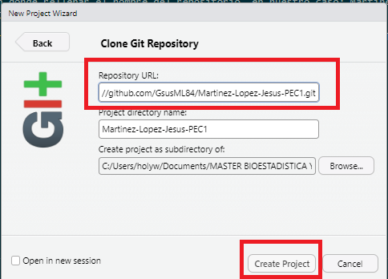{width=500 height=250}

\pagebreak

A partir de ese momento el repositorio en *GitHub* estará conectado con *RStudio* gracias al *token* de acceso personal que tenemos que haber creado previamente.
Podemos hacer *Push* y *Pull*, es decir, subir nuevas versiones modificadas o bajarlas desde, respectivamente, *GitHub*. En el panel derecho superior de *RStudio* encontramos un acceso rápido para el manejo de versiones en la pestaña *Git* (Figura 9 del Anexo II). Para hacer un *Push* hay que elaborar previamente un *commit*, esto es, elegir los archivos con los cambios que queremos subir, asociarlos a un mensaje y pulsar el botón de *Commit*:

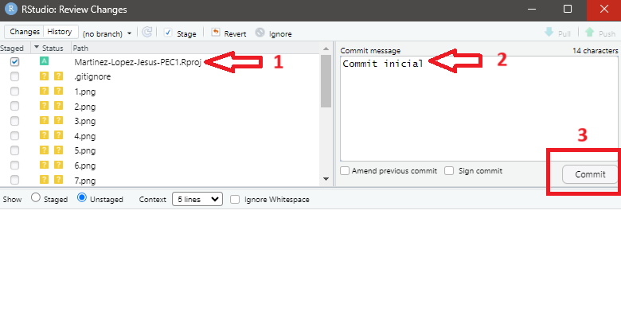{width=500 height=250}

Una vez concluido el proceso de *commit* se muestran disponibles los botones de *Pull* (azul) y *Push* (verde) (Figura 10 del Anexo II). Pulsamos en el botón *Push* para subir la versión más reciente de los archivos en local al respositorio de *GitHub*. En la pestaña *History* podemos acceder al histórico del control de versiones (Figura 11 del Anexo II)

## Discusión

El análisis exploratorio nos ha mostrado la siguiente información sobre los datos a destacar: 

- Existen numerosos valores faltantes que hemos tenido que imputar con haciendo uso del algoritmo KNN

- Las distribuciones de los metabolitos son asimétricas, razón por la cual hemos tenido que trabajar con ellos tras la transformación logarítmica y normalización.

- Hemos encontrado 3 metabolitos que podrían ser candidatos para su estudio en profundidad si queremos elaborar modelos predictivos para las categorías clínicas GC y HE.

- El Análisis de Componentes Principales nos muestra un solapamiento de la categoría clínica BN con HE y GC, más separadas entre sí.

- El lote no parece ser una fuente de variabilidad en los datos, por lo que descartamos *efecto batch*.

Por último, hemos visto que el control de versiones Git usando el esquema de *GitHub primero* es sencillo de aplicar en RStudio. El repositorio creado en *GitHub* está disponible públicamente en la dirección: **<https://github.com/GsusML84/Martinez-Lopez-Jesus-PEC1.git>**

## Referencias

<div id="refs"></div>

\pagebreak

## Anexos
### Anexo I - Código R

```{r mostrar_codigo, echo=FALSE}
# leemos el archivo generado con purl()
codigo <- readLines("PEC1.R")
# mostramos el código 
cat(codigo, sep = "\n")
```


### Anexo II - Imágenes

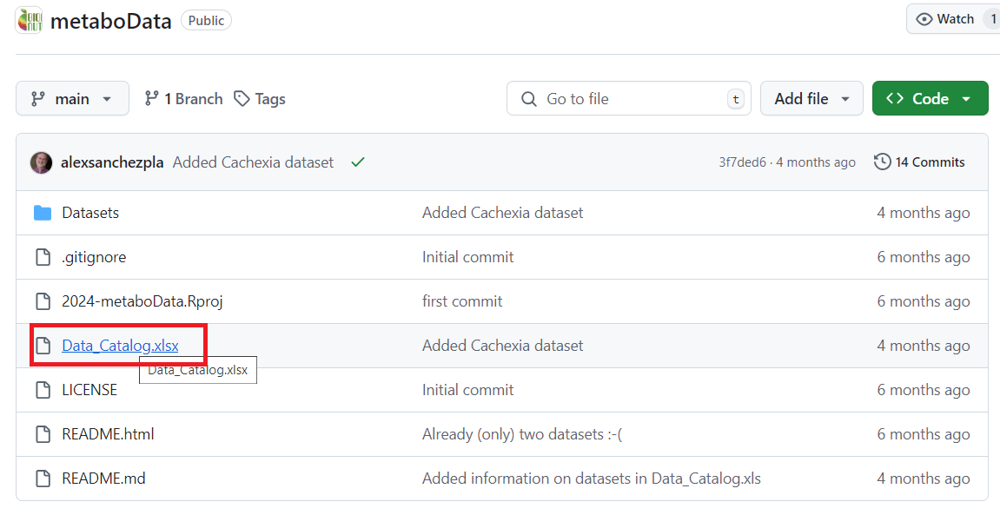{width=500 height=250}

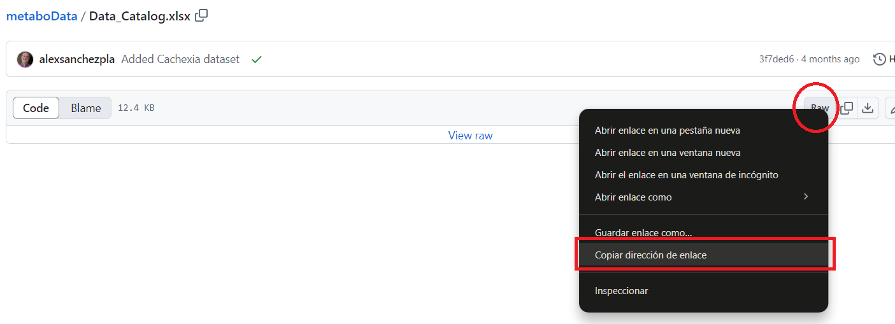{width=500 height=250}

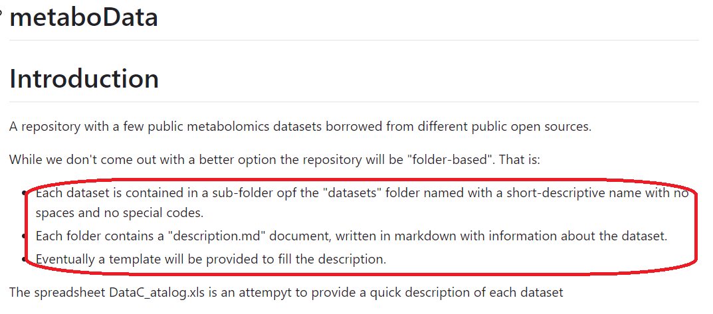{width=500 height=250}

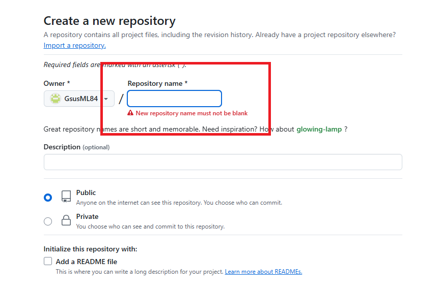{width=500 height=250}

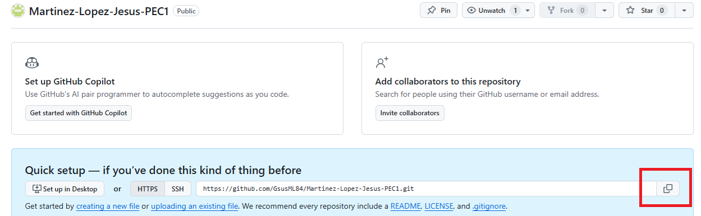{width=500 height=250}

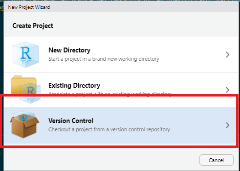{width=500 height=250}

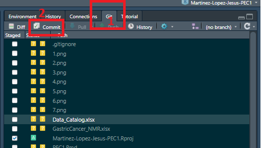{width=500 height=250}

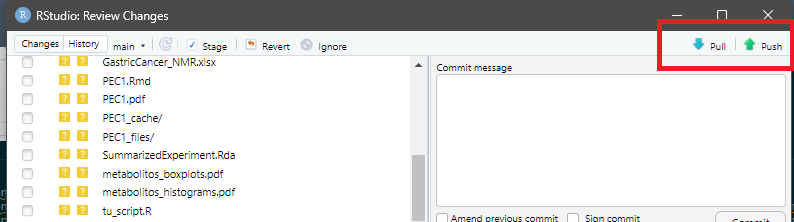{width=500 height=250}

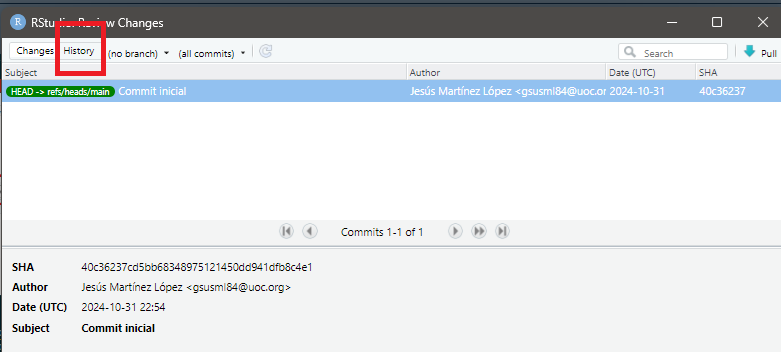{width=500 height=250}